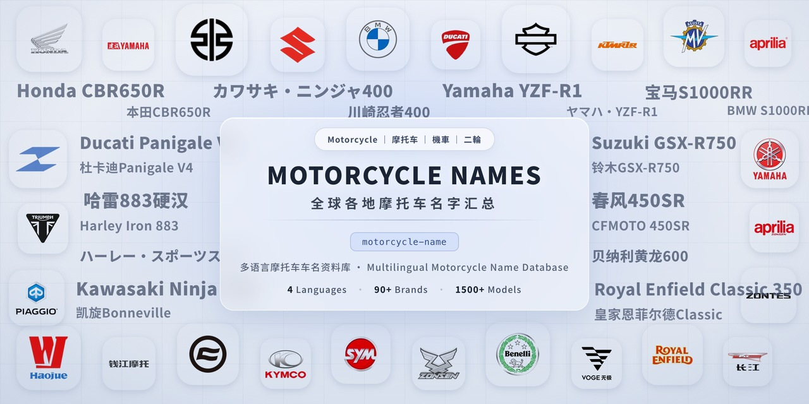

# 多语言摩托车车名资料库 / Multilingual Motorcycle Name Database

一个经过整理的全球摩托车品牌、车型、术语与分类的多语言参考资料库，面向人类与 AI。每个条目均提供**英语、简体中文、繁体中文、日语**四种语言。

A curated, multilingual reference of global motorcycle brands, models, terminology, and classes. Built for humans and AI — every entry is available in **English, Simplified Chinese, Traditional Chinese, and Japanese**.

<p align="center">
  
</p>

## 为什么做这个项目 / Why

摩托车车名在不同市场间常不一致：同一车型在不同地区使用不同名称、译名或本地变体。本项目将全球摩托车数据整理为干净、机器可读的数据集，并提供可核验的来源标注。

Motorcycle names are notoriously inconsistent across markets: the same model ships under different names, translations, and local variants. This project collects them into one clean, machine-readable dataset with verified source attribution.

## 数据亮点 / Highlights

| 项目 / Item | 数量 / Count |
|---|---|
| 品牌 / Brands | 90（15 个国家与地区 / 15 countries & regions） |
| 车型 / Models | 1,585 |
| 分类 / Classes | 41（排量、欧盟驾照、日本分类、车身形式、动力类型 / displacement, EU license, JP category, body style, powertrain） |
| 术语 / Glossary | 116 条（赛事、安全、电控 / racing, safety, electronics） |
| 跨市场异名 / Cross-market aliases | 77 |

## 语言 / Languages

每个条目均包含四种语言变体 / Every entry includes four language variants:

- `en` — English / 英语
- `zh-CN` — Simplified Chinese / 简体中文
- `zh-TW` — Traditional Chinese / 繁体中文
- `ja` — Japanese / 日语

## 目录结构 / Repository Layout

```
data/                       唯一数据源（SSOT）— 请勿直接编辑 dist/
  brands.json               品牌注册表 / Brand registry
  motorcycle_classes.json   分类引用 / Classification references
  glossary.json             术语表 / Terminology
  models/*.json             按品牌拆分车型 / Per-brand model lists
  models/cross_market.json  跨市场异名 / Same model, different market names
scripts/
  validate.py               数据完整性校验 / Integrity checks
  build.py                  合并 data/ 生成 dist/ / Merges data/ into dist/
dist/                       构建产物 / Generated outputs (JSON + Markdown)
LICENSE                     CC BY-SA 4.0
```

## 使用方法 / Usage

```bash
# 校验数据 / Validate the data
python3 scripts/validate.py

# 构建合并产物 / Build the merged outputs
python3 scripts/build.py
```

构建产物 / Generated outputs:

- `dist/motorcycle-names-database.json` — 机器可读 / machine-readable
- `dist/motorcycle-names-database.md` — 人类可读表格 / human-readable tables

## 车型条目格式 / Model Entry Format

```json
{
  "id": "model:brand:model-name",
  "brand": "Brand",
  "names": {
    "en": "...",
    "zh-CN": "...",
    "zh-TW": "...",
    "ja": "..."
  },
  "segment": "class:disp:400cc",
  "body_style": "body:naked",
  "powertrain": "pt:ice",
  "status": "current",
  "years": "2000–present",
  "note": "Short description",
  "verified": "verified"
}
```

`segment`、`body_style`、`powertrain` 引用 `data/motorcycle_classes.json` 中定义的 ID。

`segment`, `body_style`, and `powertrain` reference IDs defined in `data/motorcycle_classes.json`.

## 数据政策 / Data Policy

- 数据来源：官方品牌档案、维基百科（英/中/日）、公开参考资料 / Data is sourced from official brand archives, Wikipedia (EN/CN/JA), and public references.
- 每个条目标记为 `verified`（已核实）或 `pending`（待复核，见 `data/pending_verification.json`）/ Each entry is flagged `verified` (confirmed) or `pending` (to be reviewed, see `data/pending_verification.json`).

## 参与贡献 / Contributing

参见 / See [CONTRIBUTING.md](CONTRIBUTING.md)。

## 许可证 / License

[CC BY-SA 4.0](LICENSE) — 完整许可证文本见 `LICENSE` 文件 / See the full license text in `LICENSE`.

## 免责声明 / Disclaimer

参见 / See [DISCLAIMER.md](DISCLAIMER.md).
